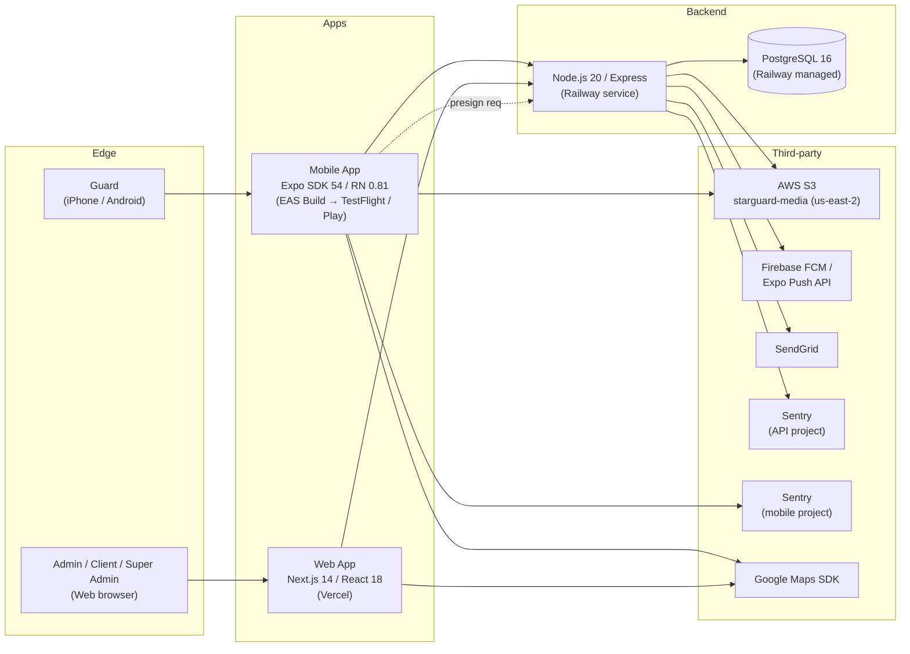

# NetraOps — Technical Requirements Document

> **Status**: Draft v1 · 2026-05-16
> **Audience**: Engineers joining the team, security reviewers, infrastructure operators.
> **Companion**: Read alongside `01-PRD.md` (product framing), `05-BACKEND-SCHEMA.md` (data model), `06-IMPLEMENTATION-PLAN.md` (roadmap).

---

## 1. System Overview

NetraOps is a three-tier system: a React Native mobile app for guards, a Next.js web app serving three role-scoped portals, and a Node/Express API backed by PostgreSQL on Railway. AWS S3 holds photo uploads. Firebase Cloud Messaging delivers pushes. SendGrid handles email. Sentry monitors errors on both mobile and API.



The mobile app talks only to the API and to S3 directly via presigned POST. The web app talks only to the API. The API is the only surface that talks to the database, SendGrid, and FCM. No service-to-service authentication is required between surfaces — JWTs flow from edge to API and never further.

## 2. Tech Stack

### Mobile (`apps/mobile`)
- `expo@^54.0.34`, `expo-router@~6.0.23`
- `react@19.1.0`, `react-native@0.81.5`
- `react-native-reanimated@~4.1.1`, `react-native-worklets@0.5.1`
- `expo-camera@~17.0.10`, `expo-location@~19.0.8`, `expo-task-manager@~14.0.9`
- `expo-image-manipulator@~14.0.8`, `expo-image-picker@~17.0.11`
- `expo-battery@~10.0.8` (Item 7 — battery throttle)
- `expo-notifications@~0.32.17`, `expo-secure-store@~15.0.8`, `expo-local-authentication@~17.0.8`
- `@sentry/react-native@~6.20.0`
- `react-native-maps@1.20.1` (Google Maps provider)
- `zustand@^4.5.2` (state management)

Source: [apps/mobile/package.json](apps/mobile/package.json).

### Web (`apps/web`)
- `next@^14.2.35`, `react@18.2.0`
- `@tanstack/react-query@^5.28.0`
- `tailwindcss@^3.4.1`
- `leaflet@^1.9.4` + `react-leaflet@^4.2.1` (admin live map)
- `jspdf@^2.5.1`, `jspdf-autotable@^3.8.2` (client portal PDF download)
- `zustand@^4.5.2`

Source: [apps/web/package.json](apps/web/package.json).

### API (`apps/api`)
- Node.js ≥ 20, `express@^4.18.3`, `express-async-errors@^3.1.1`
- `pg@^8.11.3` (Postgres driver, no ORM)
- `bcrypt@^5.1.1`, `jsonwebtoken@^9.0.2`
- `@sentry/node@^8.55.2`
- `@sendgrid/mail@^8.1.1`, `firebase-admin@^12.0.0`
- `aws-sdk@^2.1550.0` (S3 presign + range fetches)
- `node-cron@^3.0.3` (eight scheduled jobs)
- `express-rate-limit@^8.3.2`
- `multer@^1.4.5-lts.1`, `pdfkit@^0.18.0`, `xlsx@^0.18.5`
- `@anthropic-ai/sdk@^0.90.0` (server-side proxy to Claude for the report description-enhancer feature — see §7)
- `twilio@^5.13.1` (installed but unreferenced — dead dependency, see DRIFT FINDINGS)

Source: [apps/api/package.json](apps/api/package.json).

### Infrastructure
- **PostgreSQL 16** on Railway managed Postgres (project `adorable-courage`).
- **AWS S3 bucket** `starguard-media` in `us-east-2`. Bucket policy: private, no public-read ACL. Mobile uploads via presigned POST; admin reads via presigned GET.
- **Firebase Cloud Messaging** project; Sender ID `872564523776`.
- **SendGrid** with verified sender domain `alerts@netraops.com`.
- **Google Maps** (separate iOS/Android API keys in `apps/mobile/app.json`).
- **Sentry** org `netraopscom`, two projects: mobile and `netraops-api`. Business Plan Trial active, expires approximately 2026-05-30.

## 3. Non-Functional Requirements

| NFR | Target | Status |
|---|---|---|
| API median latency (authenticated read) | < 200 ms p50 | Aspirational. No production measurement; Sentry traces sample at 0.05 for early signal. |
| API p99 latency | < 1 s | Aspirational. |
| Mobile clock-in flow end-to-end | < 90 s including photo capture | Measured informally on iOS Simulator + iPhone 17 Pro; not benchmarked across device generations. |
| Daily email delivery | 9:05 AM Pacific local time | Scheduled via `node-cron` anchored to `America/Los_Angeles` ([apps/api/src/jobs/dailyShiftEmail.ts:18-19](apps/api/src/jobs/dailyShiftEmail.ts:18)). Measured to fire correctly across the 2026-03 DST flip. |
| Incident → client email | < 60 s from submit | Path: report submit → `sendIncidentAlert` synchronous SendGrid call. No telemetry yet on real delivery time. |
| Mobile offline queue drain | < 30 s after connectivity returns | `startQueueSync()` runs on shift start; manual flushes on enqueue ([apps/mobile/lib/offlineQueue.ts](apps/mobile/lib/offlineQueue.ts)). Not benchmarked. |
| Concurrent guards supported | 500 active shifts simultaneously | Aspirational. Tested at 1 shift today. |
| API availability | 99.5% (single-instance Railway) | No SLA; informally observed uptime is "high" but unmeasured. |
| Photo upload size cap | 5 MiB enforced at S3 policy | Hard limit in [apps/api/src/services/s3.ts:19](apps/api/src/services/s3.ts:19). |
| Sentry trace sample rate | 0.05 errors at 1.0 | Set explicitly in [apps/mobile/lib/sentry.ts](apps/mobile/lib/sentry.ts) and [apps/api/src/services/sentry.ts](apps/api/src/services/sentry.ts). |

**Honest summary**: most NFRs are aspirational targets. Sentry telemetry is the first real measurement layer; once it accumulates a few weeks of production traffic these targets should be revisited against actual percentiles.

## 4. Security Architecture

### 4.1 Authentication

JWT-based with separate access (8-hour TTL) and refresh (30-day TTL) tokens. Implementation in [apps/api/src/routes/auth.ts](apps/api/src/routes/auth.ts) and [apps/api/src/middleware/auth.ts](apps/api/src/middleware/auth.ts).

- **Four roles**, defined as the `UserRole` type at [apps/api/src/middleware/auth.ts:5](apps/api/src/middleware/auth.ts:5): `'guard' | 'company_admin' | 'client' | 'vishnu'`.
- **Three separate JWT secrets** (one per portal-class) per [PRODUCTION_CHECKLIST.md](PRODUCTION_CHECKLIST.md) original spec, although the current code uses a single `JWT_SECRET` for access and `JWT_REFRESH_SECRET` for refresh; the multi-secret design is partially in PRODUCTION_CHECKLIST and partially implemented.
- **Guard login flow**: POST `/api/auth/guard/login` validates against `guards.password_hash` (bcrypt), increments `login_attempts.failed_count` on bad password, locks after 5 failures ([apps/api/src/routes/auth.ts](apps/api/src/routes/auth.ts) — see schema_auth.sql `login_attempts` table).
- **Super-admin login**: POST `/api/auth/vishnu/login` validates against env vars `VISHNU_EMAIL` + `VISHNU_PASSWORD_HASH`. **There is no `vishnu_admins` table.** The sentinel UUID `00000000-0000-0000-0000-000000000000` is used as the JWT `sub` ([apps/api/src/routes/auth.ts:316-331](apps/api/src/routes/auth.ts:316)).
- **Refresh-token revocation**: `revoked_tokens` blocklist; `jti` claim on every token. Middleware fails closed if the DB is unreachable for a revocation lookup ([apps/api/src/middleware/auth.ts:49-61](apps/api/src/middleware/auth.ts:49)).
- **Per-guard session nuke**: `guards.tokens_not_before` column (schema_v10). Stamped by an admin "revoke all guard tokens" action; auth middleware rejects any token whose `iat * 1000 < tokens_not_before`.
- **Password policy**: 6–8 alphanumeric characters ([apps/api/src/routes/auth.ts:17-25](apps/api/src/routes/auth.ts:17)). Short by modern standards; reflects the field-guard usability constraint (no on-screen keyboard typing of long strings while in uniform).
- **Forgot-password flow**: generates an 8-char temp password, sets `must_change_password = true`, emails via SendGrid. On next login the user is forced through `/change-password` before any route guard lets them proceed.

### 4.2 Authorization

- **Role-based middleware**: `requireAuth(...roles)` factory at [apps/api/src/middleware/auth.ts:26](apps/api/src/middleware/auth.ts:26). Every route declares the roles allowed; mismatch returns 403.
- **Tenant isolation**: Every read/write query scopes by `company_id` (admin) or `site_id` (client). This is convention, not enforced by middleware — each route file is responsible for its own scoping. Adherence is one of AGENTS.md's non-negotiable rules.
- **Client portal scoping**: client JWTs carry a `site_id` claim; queries filter on this. A client cannot read another site's reports.
- **Primary-admin gate**: a separate `requirePrimaryAdmin()` middleware ([apps/api/src/middleware/auth.ts:91-102](apps/api/src/middleware/auth.ts:91)) for actions that only one admin per company should perform.
- **CORS**: fail-closed. `ALLOWED_ORIGINS` env var required at boot; server refuses to start without it ([apps/api/src/index.ts:63-71](apps/api/src/index.ts:63)). Native app and curl requests (no Origin header) are allowed through; cross-browser requests must match the exact origin.
- **Rate limiting**: 500 req / 15 min globally; 20 req / 15 min on `/api/auth/*` ([apps/api/src/index.ts:42-54](apps/api/src/index.ts:42)).

### 4.3 Geofence Validation (server-side)

Implementation in [apps/api/src/services/geofence.ts](apps/api/src/services/geofence.ts).

`validateClockInGeofence({ lat, lng, accuracy_m }, siteId, db)` returns `{ allowed, reason, distance_m, fence_radius_m, polygon_present }`.

- **Dual check**: inside the polygon ([ray-cast in isPointInPolygon, apps/api/src/services/geofence.ts:2-16](apps/api/src/services/geofence.ts:2)) **OR** inside `(center + radius + accuracy + 50m safety margin)`. The 50 m margin absorbs GPS noise without widening the polygon itself.
- **Polygon-first**: more accurate for irregular sites; radius is fallback for sites whose polygon hasn't been remapped.
- **Same helper used at two seams**: inside `POST /api/shifts/:id/clock-in` (running against the transaction's PoolClient, [apps/api/src/routes/shifts.ts](apps/api/src/routes/shifts.ts) — see "Concurrency model" comment block), AND at `POST /api/locations/clock-in-verification` against the pool ([apps/api/src/routes/locations.ts](apps/api/src/routes/locations.ts)).
- **Wire compatibility**: `is_within_geofence` is still accepted in the verification payload for backwards compat with older app builds, but its value is **ignored** — server computes its own truth and writes that to the DB.
- **Reject path**: 422 GEOFENCE_FAILED with a structured body (`{ error, message, distance_m, accuracy_m, reason }`) and a one-line `info` log: `geofence.reject site=<id> guard=<id> shift=<id> distance=<m> accuracy=<m> reason=<polygon|radius|both>`.

### 4.4 Idempotency

Implementation in [apps/api/src/services/idempotency.ts](apps/api/src/services/idempotency.ts).

`idempotent(scope)` Express middleware reads the `Idempotency-Key` header, looks up `${guard_id}:${scope}:${header}` in an in-process LRU. Applied to `POST /api/shifts/:id/clock-in`.

- **Cache**: Map-based, 1000-entry cap, 10-minute TTL, insertion-order eviction.
- **On hit**: response replayed with `Idempotent-Replay: true` header; handler is skipped.
- **On miss**: `res.status` and `res.json` are patched to capture status + body, then `next()` continues. Both 2xx and 4xx responses are cached — replaying a legitimate 422 GEOFENCE_FAILED is the correct outcome.
- **Unhandled throws are NOT cached** by design. Express's default error handler uses `res.end(html)` and bypasses the patched `res.json`. Caching an opaque 500 from a transient error would prevent legitimate retries.
- **Mobile generates the key**: lazy `useState(() => uuidv4())` at the top of [apps/mobile/app/clock-in/step4.tsx](apps/mobile/app/clock-in/step4.tsx) creates one UUID per mount. Re-entering the screen (via `router.replace('/clock-in/step1')` after a 422) re-mounts and produces a fresh UUID.
- **Data-integrity backstop**: even if the in-process cache is lost (Railway restart mid-request), the partial unique index `idx_shift_sessions_one_open_per_guard` ([apps/api/src/db/schema_v9.sql:17-19](apps/api/src/db/schema_v9.sql:17)) turns a duplicate insert into a 23505 → 409.

### 4.5 Magic-byte Validation on Photo Uploads

Implementation in [apps/api/src/services/imageMagic.ts](apps/api/src/services/imageMagic.ts).

`magicMatches(contentType, head)` validates the first ≥12 bytes of an S3 object against the expected signature for its declared MIME:
- `image/jpeg` → `FF D8 FF`
- `image/png` → `89 50 4E 47 0D 0A 1A 0A`
- `image/webp` → `RIFF…WEBP` (non-contiguous, bytes 0–3 + 8–11)

`describeMagic(head)` returns a forensic label for the quarantine row — recognized image MIMEs, `zip`, `php`, `html`, or `hex:<first8>`.

**Three call sites** all run this check synchronously before any DB write:
- `POST /api/reports` ([apps/api/src/routes/reports.ts:143-193](apps/api/src/routes/reports.ts:143)) for every photo URL in the payload.
- `POST /api/locations/ping` ([apps/api/src/routes/locations.ts](apps/api/src/routes/locations.ts)) when `photo_url` is present.
- `POST /api/locations/clock-in-verification` ([apps/api/src/routes/locations.ts](apps/api/src/routes/locations.ts)) for selfie + site photo.

Mismatch path: insert row into `quarantined_uploads` ([apps/api/src/db/schema_v11.sql:14-23](apps/api/src/db/schema_v11.sql:14)) for forensics, return 400 with the detected magic label in the error message.

URL allowlist defense: `s3KeyFromPublicUrl` ([apps/api/src/services/s3.ts:116-126](apps/api/src/services/s3.ts:116)) rejects URLs that don't point at our bucket. Closes URL-substitution attacks.

### 4.6 EXIF Strip via ImageManipulator Native Pipeline

No explicit EXIF-strip option exists in `expo-image-manipulator@~14.0.8` — the `SaveOptions` type only exposes `base64`, `compress`, `format`. EXIF is stripped as a side effect of the native pipeline:

- **iOS**: `UIImage.jpegData(compressionQuality:)` / `UIImage.pngData()` serialize pixel data only. EXIF is metadata on the original file; `UIImage` doesn't carry it.
- **Android**: `Bitmap.compress(format, quality, fileOut)` writes pixel data only. Decoding a JPEG into a `Bitmap` discards file-level metadata.

The contract is documented as a non-negotiable in [AGENTS.md](AGENTS.md) Rules section: every photo upload path must route through `ImageManipulator.manipulateAsync`. Inline comments at all five call sites flag this. See `01-PRD.md` §4.1 for the product-level framing ("Visual Intelligence" positioning).

**Verification status**: confirmed by source analysis. Empirical verification (run `exiftool` on a fresh S3 object after a TestFlight build) is on the verification list in `06-IMPLEMENTATION-PLAN.md`.

### 4.7 Sentry Scrubber Configuration

Both mobile ([apps/mobile/lib/sentry.ts](apps/mobile/lib/sentry.ts)) and API ([apps/api/src/services/sentry.ts](apps/api/src/services/sentry.ts)) install a `beforeSend` + `beforeBreadcrumb` hook that strips:

**Common keys** (case-sensitive):
- `password`, `token`, `secret`, `api_key`, `apiKey`
- `authorization`, `Authorization`
- `access`, `refresh`, `access_token`, `refresh_token`
- `email`, `fcm_token`

**API-additional**:
- `JWT_SECRET`, `jwt_secret`
- `AWS_SECRET_ACCESS_KEY`
- `SENDGRID_API_KEY`

**S3 presigned URL signature stripping** (both surfaces): regex `([?&])(X-Amz-[^&=]+|Signature|Policy|Credential)=[^&]+` replaces the value with `[scrubbed]` in URLs, exception messages, and breadcrumb data.

Replacement happens recursively up to depth 6 on event request data, contexts, extra fields, and exception value strings.

### 4.8 S3 Presigned POST Hardening

Implementation in [apps/api/src/services/s3.ts:38-65](apps/api/src/services/s3.ts:38).

Each presigned POST policy pins:
- `bucket` — fixed to `starguard-media`
- `key` — server-generated, format `${context}/${company_id}/${date}/${uuid}.${ext}`
- `Content-Type` — pinned to `image/jpeg` today (the mobile client sends nothing else)
- `content-length-range: [1, 5 * 1024 * 1024]` — 5 MiB cap

Policy expires after 300 seconds (5 minutes). Any drift on POST (oversized body, mismatched type, key tampering) yields a 403 from S3.

### 4.9 Quarantined Uploads Table

[apps/api/src/db/schema_v11.sql](apps/api/src/db/schema_v11.sql). Three endpoints now write to it (reports, ping, clock-in-verification). No admin UI yet — review via direct SQL:

```sql
SELECT * FROM quarantined_uploads ORDER BY detected_at DESC LIMIT 50;
```

Indexes for `(guard_id, detected_at)` and `(company_id, detected_at)` support both per-guard and per-tenant review patterns. The orphan S3 object remains in the bucket; lifecycle policy is intended to delete it at 180 days but is unverified.

## 5. Observability

### 5.1 Sentry

**Mobile**: `@sentry/react-native@~6.20.0`, init gated on `EXPO_PUBLIC_SENTRY_DSN` truthy. Source-map upload wired via `@sentry/react-native/expo` config plugin in `app.json` (organization `netraopscom`, project `netraops-mobile`). Release format `${bundleId}@${version}+${buildNumber}` derived from EAS build metadata.

**API**: `@sentry/node@^8.55.2`, init gated on `SENTRY_DSN` truthy. **MUST be imported before `express`** so v8's auto-instrumentation patches the Express prototype; this is why `import { Sentry } from './services/sentry'` is the first line of [apps/api/src/index.ts](apps/api/src/index.ts). `Sentry.setupExpressErrorHandler(app)` runs after all routes and captures errors before delegating to Express's default 500 handler — clients still receive the standard 500 response.

**Tags pushed**: `user_id` (via `Sentry.setUser({ id })`), `company_id`, `role`, `env`, `device_os` (mobile), `app_version`, `build_number`, `shift_id` (mobile, when an active shift exists), `endpoint` (API, per-request via `tagRequest()` in [apps/api/src/middleware/auth.ts:88](apps/api/src/middleware/auth.ts:88)).

**Sample rates**: `tracesSampleRate: 0.05`, `sampleRate: 1.0` for errors. Conservative — solo-founder scale doesn't need volume.

**Telemetry events generated**:
- Battery throttle transitions emit Sentry breadcrumbs (NOT events) on every state change via [apps/mobile/lib/batteryThrottle.ts](apps/mobile/lib/batteryThrottle.ts). Format: `battery_throttle transition=<from>→<to>` with `{from, to, battery_pct, low_power_mode, effective_interval_ms}` data. Well-tuned hysteresis should produce 1–2 transitions per shift; flapping would be visible as 50+ in the breadcrumb trail of any event.

**Verification status as of 2026-05-16**: Sentry is live and capturing real events. First real bug caught on initial install: `watchPositionImplAsync` failure due to missing location permission (handled error, not crash). Tagged correctly: `device=iPhone 17 Pro arm64`, `OS=iOS 26.3.1`, `release=1.0.0 (17)`, `env=production`. Source-map upload status is **unverified** — see DRIFT FINDINGS for the Sentry project-slug discrepancy that may have caused silent upload failures.

### 5.2 Logs

API console logs to stdout, captured by Railway. No structured logging framework (Pino, Winston). Specific log line patterns:
- `[email] sendIncidentAlert: …` — per-incident delivery trace
- `[fcm] / [expo-push]` — push delivery
- `[nightly-purge]` — cron output
- `geofence.reject ...` — server-side geofence rejection at `info` level

Sentry doesn't ingest these logs; the Railway dashboard is the primary log surface today.

## 6. Data Retention

| Surface | Window | Mechanism |
|---|---|---|
| Reports + report photos (client portal access) | 90 days from `created_at` | `nightlyPurge.ts` step 2 disables client access via `data_retention_log.client_star_access_disabled = true` and toggles `clients.is_active = false` |
| Reports + photos (admin portal access) | 90–150 days, super-admin only | After step 2 above, only super admin reads remain |
| Reports + photos (deletion) | 150 days hard delete | `nightlyPurge.ts` step 4 deletes operational data for sites past day 150 |
| Vishnu day-140 warning | 10 days before deletion | Email via `sendVishnu140DayWarning` |
| Ping photos (rolling) | 7 days from `photo_delete_at` | `nightlyPurge.ts` step 1 deletes S3 object + nulls `location_pings.photo_url`. Skips rows with `retain_as_evidence = true` (open geofence violation evidence) |
| Notifications (push log) | 30 days | `nightlyPurge.ts` step 5 |
| Chat messages | Window TBD | `chatRetention.ts` exists, only 19 lines — implementation not reviewed in this pass |

Cron schedule: `0 0 * * *` UTC ([apps/api/src/jobs/nightlyPurge.ts:17](apps/api/src/jobs/nightlyPurge.ts:17)). **The retention model is implemented in code; the scheduled job has not yet processed real customer data crossing the 150-day boundary.** First scheduled run that crosses the boundary occurs September 2026, at which point the model becomes load-bearing. Pre-flight verification (replay against a copy of the production DB, audit which rows would be deleted) is on the Implementation Plan.

## 7. Third-Party Dependencies

| Service | Used for | Fallback story |
|---|---|---|
| Railway (Postgres + API host) | Primary database and API runtime | None — outage = full platform outage. Single-region (us-east). Daily backups via Railway's default policy; restore procedure not documented or tested. |
| AWS S3 | Photo + PDF storage | S3 outage = uploads fail. Mobile shows "S3 not configured" path and reports proceed with `selfie_url: 'pending'` (legacy fallback, marked for removal). |
| Firebase FCM + Expo Push API | Push notifications | Expo Push API for `ExponentPushToken[*]` tokens; Firebase Admin SDK for raw FCM tokens ([apps/api/src/services/firebase.ts:54-110](apps/api/src/services/firebase.ts:54)). If Firebase admin credentials are missing, Expo tokens still work — degraded but functional. |
| SendGrid | All transactional email (4 types) | No fallback. Outage = email queue grows in SendGrid; if our API call fails, no internal retry queue. |
| Google Maps SDK | Map tiles on mobile and admin live map | Two separate API keys (iOS / Android). If keys lapse, maps render blank but the rest of the app functions. |
| Sentry | Error monitoring | Init no-ops if DSN absent. Sentry outage = no telemetry but no app impact. |
| Anthropic API | Powers `POST /api/ai/enhance-description` — rewrites a guard's raw report text into a professional security-report entry. Available to `guard` and `company_admin` roles. Model ID `claude-sonnet-4-5-20250929` by default, overridable via `ANTHROPIC_MODEL` env var (set to roll forward without a redeploy when Anthropic retires a model — a previous pin was retired 2026-04-20 and the endpoint 404'd until the env was rolled). 529-retry-with-exponential-backoff (3 attempts, base 1000 ms). See [apps/api/src/routes/ai.ts](apps/api/src/routes/ai.ts). | Optional. Absence (or 5xx from Anthropic) makes the description-enhancer button fail; the guard can still submit a raw description and the report goes through. Outage degrades feature, not core flow. |
| Twilio | Installed (`twilio@^5.13.1`) but **never imported anywhere in `apps/api/src`** — confirmed dead via grep. Likely artifact of a prior SMS-OTP scaffolding attempt. | n/a — currently provides zero capability. |

## 8. Deployment Topology

| Surface | Host | Pipeline | Status |
|---|---|---|---|
| API | Railway service in `adorable-courage` project | `git push origin main` → Railway auto-deploys | Live, single-instance, no horizontal scaling |
| Postgres | Railway managed Postgres (same project) | n/a | Live, PG 16, single-instance, Railway default backups |
| Web | Vercel (`apps/web`) | `git push origin main` → Vercel auto-deploys | Live at app.netraops.com (also a `guard-web-one.vercel.app` legacy URL still referenced from Play Store) |
| Mobile iOS | EAS Build → TestFlight | `cd apps/mobile && eas build --platform ios --profile <preview\|production>`; `eas submit` for App Store | TestFlight active; App Store review pending |
| Mobile Android | EAS Build → Google Play | `eas build --platform android --profile production` + `eas submit` to internal track | Internal-testing track live; production track pending closed-test feedback |
| Marketing site / Privacy / Terms | Vercel (same `apps/web`) | Same as above | Live |

**The deploy pipeline currently has a gap**: the API's `package.json` start script is `node dist/index.js` — it does NOT chain `npm run db:migrate`. See §10 Known Technical Debt for the May 16 incident and remediation.

## 9. Environment Configuration

### API (Railway → Variables)
- `DATABASE_URL` (Railway-injected when DB is linked)
- `JWT_SECRET`, `JWT_REFRESH_SECRET`, `VISHNU_JWT_SECRET`, `CLIENT_JWT_SECRET` (separate-secret-per-portal design partly implemented)
- `VISHNU_EMAIL`, `VISHNU_PASSWORD_HASH` (super admin credentials — no DB row)
- `AWS_ACCESS_KEY_ID`, `AWS_SECRET_ACCESS_KEY`, `AWS_REGION` (us-east-2), `S3_BUCKET` (starguard-media)
- `SENDGRID_API_KEY`, `SENDGRID_FROM_EMAIL`
- `ALLOWED_ORIGINS` (CORS allowlist — required, fail-closed)
- `PORT` (Railway sets automatically)
- `SENTRY_DSN` (optional; init no-ops if absent)
- `SENTRY_ENV` (optional; defaults to `NODE_ENV` or `'production'`)
- `EXPO_PUBLIC_API_URL` (used by some test scripts)
- `CLIENT_PORTAL_URL` (used in email templates)
- Firebase: either `secrets/firebase-service-account.json` file OR env triple (`FIREBASE_PROJECT_ID`, `FIREBASE_PRIVATE_KEY`, `FIREBASE_CLIENT_EMAIL`)
- `ANTHROPIC_API_KEY` (if `/api/ai` is enabled)

### Web (Vercel → Environment Variables)
- `NEXT_PUBLIC_API_URL` — production API base URL
- `JWT_SECRET` — same value as API; used by Next.js Edge Middleware for cookie verification

### Mobile (`apps/mobile`)
- `EXPO_PUBLIC_API_URL` — set in `eas.json` per build profile (development → localhost, preview/production → Railway URL)
- `EXPO_PUBLIC_SENTRY_DSN` — EAS Secret, registered via `eas secret:create`
- `EXPO_PUBLIC_SENTRY_ENV` — set in `eas.json` per profile (`preview` or `production`); absent in dev
- `SENTRY_AUTH_TOKEN` — EAS Secret, used at build time for source-map upload (not bundled into the app)
- `EAS_PROJECT_ID` — hardcoded in `_layout.tsx` for `getExpoPushTokenAsync({ projectId })`

### Build-time secrets
- `google-service-account.json` — Android submit credential (gitignored)
- `firebase-service-account.json` — server FCM credential (gitignored, lives in `apps/api/secrets/`)

## 10. Known Technical Debt

### 10.1 `chat_rooms` and `chat_messages` not reproducible from migrations (Operational + Recovery — highest severity in the doc set)

**Finding**: [apps/api/src/routes/chat.ts:36-40](apps/api/src/routes/chat.ts:36) queries `chat_messages` (`cm.message`, `cm.created_at`, `cm.sender_role`); [apps/api/src/db/schema_v13.sql:34](apps/api/src/db/schema_v13.sql:34) has `REFERENCES chat_rooms(id) ON DELETE CASCADE`. Neither `CREATE TABLE chat_rooms` nor `CREATE TABLE chat_messages` exists in any of the 16 schema files (`schema.sql`, `schema_auth.sql`, `schema_v2.sql` … `schema_v14.sql`).

**How it got this way**: the chat feature was likely added by hand-running `CREATE TABLE` against the live Railway database without committing a corresponding schema file. Subsequent migrations passed because the FK target existed in prod. The hole is silent until you try to reproduce the schema from scratch.

**Blast radius**:
- Disaster recovery from a Railway-backup restore to a fresh instance: chat tables won't exist; `schema_v13.sql`'s `CREATE TABLE chat_room_reads ... REFERENCES chat_rooms(id)` fails at migration time.
- Spinning up a local development environment: same failure.
- New engineer joining the team running `npm run db:migrate`: same failure.
- Spinning up a staging environment: same failure.

**Suggested action**: capture the actual definitions from production via `pg_dump --schema-only --table=chat_rooms --table=chat_messages` against the live Railway DB. Create `apps/api/src/db/schema_v15.sql` with the recovered definitions plus any indexes that exist in prod. Append `'schema_v15.sql'` to the `migrate.ts` file list. Verify by spinning up a fresh local Postgres (Docker container) and running the full migration sequence; if the app boots end-to-end with `npm run db:migrate && npm start && curl /health`, the fix is good.

**Severity**: Operational + Recovery.

**Owner**: Decision needed on timing (this week vs. next session). Disaster recovery is not a defer-able concern. Tracked in `06-IMPLEMENTATION-PLAN.md` Immediate Backlog.

### 10.2 API start script does not run migrations (Operational — high severity)

**Finding**: [apps/api/package.json:8](apps/api/package.json:8) start script is `"start": "node dist/index.js"`. The `db:migrate` script exists alongside but is not chained.

**The May 16, 2026 incident** (teaching example): a production deploy of `main` shipped code referencing `sites.ping_interval_minutes` (added by `schema_v14.sql`, commit `5a21320`) before the migration ran on Railway. Railway's start command is just `npm start`, which does not invoke `db:migrate`. The mobile app showed "No scheduled shift" for an active James Vince shift while the admin portal showed it as active. Resolution: manually running `railway run npm run db:migrate` from the developer machine populated the column; the next API restart picked up the new schema.

**Why this matters**: the bug shipped to production was not the schema — it was the assumption that the production environment auto-runs migrations. It does not. Every schema change is one manual operator step away from causing a partial outage.

**Permanent fix**: change [apps/api/package.json](apps/api/package.json) start script to `"start": "npm run db:migrate && node dist/index.js"`. This makes every deploy idempotent — re-deploying applies any pending migrations before the API serves requests; deploys with no new migrations are no-ops on the migration step.

**Severity**: Operational. Goes into Implementation Plan's Immediate Backlog with red urgency.

**Owner**: Single-file change. Can ship in a focused commit.

### 10.3 Migration runner has no down migrations (Architectural — design limitation)

**Finding**: [apps/api/src/db/migrate.ts](apps/api/src/db/migrate.ts) is a hardcoded array of forward-only `.sql` filenames. No tracking table records which migrations ran. No rollback hook. Idempotency is by convention (every file uses `IF NOT EXISTS` / `IF EXISTS`).

**Recovery story**: restore from Railway daily backup. There is no `migrate down` capability and there will not be one without a meaningful infra investment.

**Implication**: every schema change is a one-way door. Pre-deploy review of `schema_vN.sql` is the only safety net.

**Severity**: Architectural design limitation, not a defect. Worth budgeting "migration tracking + rollback" as its own infrastructure session before the schema grows much further.

### 10.4 Idempotency cache is in-process (Architectural — blocks horizontal scaling)

**Finding**: [apps/api/src/services/idempotency.ts](apps/api/src/services/idempotency.ts) uses a Node-process-local `Map`. Railway today runs a single API instance, so this works. The moment a second instance comes online, idempotency replays will be inconsistent (each instance has its own cache).

**Mitigation today**: the partial unique index on `shift_sessions` is still the data-integrity backstop, so the worst case is "user sees 409 instead of a replayed 201."

**Replacement path when horizontal scaling matters**: Redis (Railway has a managed Redis add-on). One-shift refactor: replace the in-process Map with a Redis-backed cache keyed identically.

### 10.5 `is_within_geofence` field still on wire (Cosmetic — backwards-compat artifact)

`POST /api/locations/clock-in-verification` still accepts `is_within_geofence` in the payload (Q14 decision). The server ignores the value; it computes its own truth and writes that to the DB. Kept on the wire so older app builds don't break.

**Removal plan**: drop the field from the payload schema after 2026 Q3 once old mobile builds have rolled off.

### 10.6 `@v-wing/api` and `@v-wing/web` legacy package names (Cosmetic — branding consistency)

`apps/api/package.json:2` is `"name": "@v-wing/api"`. `apps/web/package.json:2` is `"name": "@v-wing/web"`. Mobile is `@guard/mobile`. Three different naming conventions in one monorepo, none of which match the platform brand (NetraOps).

**Rename plan**: coordinated PR changing all three to `@netraops/*`. Touches `package.json` of each workspace, all internal imports of `@guard/shared` (if the shared package is renamed too), possibly the Railway service name, and any CI references.

### 10.7 `quarantined_uploads` has no admin UI (Operational — accumulating)

Three endpoints now write to this table (reports, ping, clock-in-verification). No admin surface exists to review the rows. Today's only access path is direct SQL. As ping volume grows, this table will accumulate rows that no one reads.

**Suggested action**: a single page in the Super Admin Portal or Admin Portal showing the last 50 entries with filters by guard / company / detected magic. A read-only forensics view is sufficient; no edit capability needed.

### 10.8 No horizontal scaling (Operational — capacity ceiling)

Single API instance, single Postgres instance, single Redis-less idempotency cache. Comfortable headroom at current scale (one paying customer in onboarding). Becomes a real concern at the 500-concurrent-shifts NFR target.

**Path forward when scaling matters**: Railway's autoscaling features for the API service; PgBouncer or Railway's managed pooler for Postgres; Redis for idempotency cache.

---

## DRIFT FINDINGS

| Finding | Severity | Suggested action | Owner |
|---|---|---|---|
| `apps/mobile/app.json:80-81` declares `project: "netraops-mobile"`; the actual Sentry project slug is `react-native` (Sentry's auto-default). Source-map upload may have been silently failing since the first build. | Operational | Rename the Sentry project to `netraops-mobile` in the Sentry UI to match the code. After the rename, deliberately throw a JS error from a TestFlight build and verify a readable (not minified) stack trace appears in Sentry. | Vishnu (operator-side in Sentry UI), then verification on next TestFlight |
| `PRODUCTION_CHECKLIST.md` is pre-NetraOps-rebrand and contradicts the live system on five concrete points: domain (`guard.com` → `netraops.com`), S3 bucket (`guard-media-prod` → `starguard-media`), ping cadence (5 min → 30 min default), schema (19 tables → 25), and operator setup (instructs `INSERT INTO vishnu_admins` against a non-existent table). | Operational | Treat the file as legacy. Either rewrite end-to-end against the current 11-commit baseline OR delete and replace with a leaner checklist that only covers operational steps not documented elsewhere. | Focused follow-up commit, requires Vishnu's call on rewrite-vs-replace |
| `AGENTS.md:10` claims "22 tables." Actual count is 25 (see `05-BACKEND-SCHEMA.md`). `AGENTS.md` Week-1 phase block (lines 48-54) lists Phase C "IN PROGRESS" and Phase D "PENDING"; both shipped. | Operational | Single focused commit aligning AGENTS.md to current reality (same pattern as `d3f37b1`). | Follow-up session |
| Mobile has two report-creation entry points: unified [apps/mobile/app/reports/new.tsx](apps/mobile/app/reports/new.tsx) (canonical per the 2026-05-15 UX comment) and dead per-type forms under [apps/mobile/app/reports/new/](apps/mobile/app/reports/new/) (explicitly "no longer routed to" per the comment in `new.tsx` line 14). | Cosmetic | Delete the per-type form files in a focused cleanup commit; verify with `find apps/mobile -name "reports/new/*.tsx"` returns nothing afterwards. | Follow-up session |
| Two privacy pages: [/privacy](apps/web/app/privacy/page.tsx) is NetraOps-branded and current (effective 2026-05-13); [/privacy-policy](apps/web/app/privacy-policy/page.tsx) is older "Netra" content (effective 2026-04-14). Play Store metadata references `/privacy-policy` per prior session notes. | Operational | Make `/privacy-policy` a server-side redirect to `/privacy` OR update its content to match. Update Play Store metadata to point at `/privacy` directly. | Vishnu (Play Store side) + focused commit (web redirect) |
| `chatRetention.ts` is a 19-line file not reviewed in detail during this pass. May not enforce a window. | Cosmetic | Confirm the chat retention window during the Schema doc pass and document it in §6 above. | This session, during Schema doc |
| `twilio@^5.13.1` is installed in [apps/api/package.json](apps/api/package.json) but **`grep -rn "twilio" apps/api/src` returns zero matches** — confirmed dead dependency. Almost certainly an artifact of an earlier SMS-OTP scaffolding attempt that was deferred. The package adds install-time download cost and security-audit surface for no shipping capability. | Cosmetic | `npm uninstall twilio --workspace=@v-wing/api` in a focused dependency-cleanup commit. When SMS OTP becomes a real workstream, re-add the dependency at the version current at that time. | Single-file follow-up commit; can be batched with other dependency cleanup |

---

*End of TRD. Word count: ~3,400. Next document: UX Design.*
