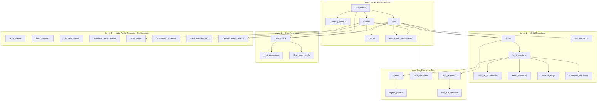

# NetraOps — Backend Schema Document

> **Status**: Draft v1 · 2026-05-16
> **Audience**: Backend engineers, anyone running DB queries, anyone investigating data integrity.
> **Source of truth**: Live production database (PostgreSQL 18.3 on Railway, project `adorable-courage`) verified via `psql` on 2026-05-16. Where a table is missing from the committed migration files but present in production, this document leads with that disclosure. See TRD §10.1 for the orphan classification framework.

---

## 1. Schema Overview

29 tables in production, organized into five logical layers. Tenant isolation is by `company_id` (or by `site_id` for client-facing data). All primary keys are UUIDs; all timestamps are `TIMESTAMPTZ` in UTC.



The mobile/web app sees a tree rooted at `companies`. Every business-data query scopes by `company_id` (admin) or `site_id` (client) — see §6 Multi-Tenancy Model.

## 2. Migration History

`apps/api/src/db/migrate.ts` runs these files in order. Each is idempotent via `CREATE TABLE IF NOT EXISTS` / `ADD COLUMN IF NOT EXISTS` etc. — re-running is safe. No down migrations; recovery is restore-from-backup.

| File | Purpose |
|---|---|
| `schema.sql` | 19 base tables — companies, sites, guards, shifts, sessions, reports, location_pings, tasks, breaks, data_retention_log, etc. Defines the core schema. |
| `schema_auth.sql` | Auth additions — `auth_events`, `login_attempts`, `revoked_tokens` plus `guards.must_change_password` and `guards.fcm_token` columns. |
| `schema_v2.sql` | (Not opened during this pass. Idempotent by convention.) |
| `schema_v3.sql` | (Not opened during this pass.) |
| `schema_v4.sql` | (Not opened during this pass.) |
| `schema_v5.sql` | (Not opened during this pass.) |
| `schema_v6.sql` | (Not opened during this pass.) |
| `schema_v7.sql` | Drops NOT NULL on `sites.contract_end`, `data_retention_log.client_star_access_until`, `data_retention_log.data_delete_at` so sites can be created without a contract end (per memory `session_apr15_2026.md`). |
| `schema_v8.sql` | (Not opened during this pass.) |
| `schema_v9.sql` | Adds partial unique index `idx_shift_sessions_one_open_per_guard ON shift_sessions(guard_id) WHERE clocked_out_at IS NULL` — the clock-in race backstop combined with FOR UPDATE locking in the route handler. |
| `schema_v10.sql` | Adds `guards.tokens_not_before` for admin-triggered per-guard session revocation; restates the `idx_revoked_tokens_jti` index for defense in depth. |
| `schema_v11.sql` | Adds `quarantined_uploads` table for D2 magic-byte-mismatch forensics. |
| `schema_v12.sql` | Adds `must_change_password BOOLEAN DEFAULT false` to `company_admins` and `clients` (guards already had it from `schema_auth.sql`). |
| `schema_v13.sql` | Adds `notifications` (push log) and `chat_room_reads` (per-room per-user last-read timestamp). Note: this file references `chat_rooms(id)` via FK but `chat_rooms` itself has no committed migration — see §10 DRIFT FINDINGS. |
| `schema_v14.sql` | Adds `sites.ping_interval_minutes INTEGER NOT NULL DEFAULT 30 CHECK (BETWEEN 5 AND 240)` (Item 8, configurable cadence) and `location_pings.throttle_reason VARCHAR(50) CHECK (NULL OR IN 'low_battery','low_power_mode')` (Item 7 prep). |

**Missing migrations** — four tables in production have no `CREATE TABLE` in any committed file: `chat_rooms`, `chat_messages`, `monthly_hours_reports`, `password_reset_tokens`. The remediation plan creates `schema_v15.sql` to reproduce all four — see TRD §10.1.

## 3. Tables

Tables documented in dependency order. For each: purpose, key columns, notable constraints and indexes, FK relationships, behaviors. Full DDL only for the four orphan tables (where the live DB is the only source of truth).

### 3.1 Layer 1 — Access & Structure

#### `companies`

Tenant root. One row per security company.

- `id UUID PK DEFAULT uuid_generate_v4()`
- `name VARCHAR(255) NOT NULL`
- `default_photo_limit INTEGER NOT NULL DEFAULT 5` — override per-site via `sites.photo_limit_override`
- `is_active BOOLEAN NOT NULL DEFAULT true`
- `created_at TIMESTAMPTZ NOT NULL DEFAULT NOW()`

Cascade: deleting a company cascades to `company_admins`, `sites`, `guards`.

#### `company_admins`

Security-company admin accounts.

- `id UUID PK`, `company_id UUID FK → companies(id) ON DELETE CASCADE`
- `name VARCHAR(255)`, `email VARCHAR(255) NOT NULL UNIQUE`, `password_hash VARCHAR(255)`
- `is_primary BOOLEAN DEFAULT false`, `is_active BOOLEAN DEFAULT true`, `must_change_password BOOLEAN DEFAULT false` (from schema_v12)
- `created_at TIMESTAMPTZ DEFAULT NOW()`

**Partial unique index** `idx_company_admins_one_primary ON company_admins(company_id) WHERE is_primary = true` — enforces one primary admin per company.

#### `sites`

Physical site under a company.

- `id UUID PK`, `company_id UUID FK → companies(id) ON DELETE CASCADE`
- `name VARCHAR(255)`, `address VARCHAR(500)`
- `photo_limit_override INTEGER` (NULL → falls back to `companies.default_photo_limit`)
- `is_active BOOLEAN DEFAULT true`
- `contract_start DATE NOT NULL`, `contract_end DATE` (made nullable in `schema_v7.sql`)
- `client_access_disabled_at TIMESTAMPTZ` — stamped by the nightly purge when day 90 hits
- `ping_interval_minutes INTEGER NOT NULL DEFAULT 30 CHECK (BETWEEN 5 AND 240)` — Item 8 per-site cadence (added in `schema_v14.sql`)
- `created_at TIMESTAMPTZ DEFAULT NOW()`

#### `clients`

End-client portal accounts. One per site.

- `id UUID PK`, `site_id UUID FK → sites(id) ON DELETE CASCADE UNIQUE`
- `name`, `email NOT NULL UNIQUE`, `password_hash`, `is_active`, `must_change_password` (from schema_v12)

The `site_id UNIQUE` constraint enforces one client account per site.

#### `guards`

Field workers.

- `id UUID PK`, `company_id UUID FK → companies(id) ON DELETE CASCADE`
- `name`, `email NOT NULL UNIQUE`, `password_hash`, `badge_number VARCHAR(100) NOT NULL UNIQUE`
- `is_active BOOLEAN DEFAULT true`
- `must_change_password BOOLEAN DEFAULT true` (from `schema_auth.sql` — defaults TRUE so admin-issued accounts force a change on first login)
- `fcm_token TEXT` — Expo push token, updated on each login (path A) or via `/api/auth/guard/fcm-token` (path B)
- `tokens_not_before TIMESTAMPTZ` (from schema_v10) — admin-triggered per-guard session revocation cursor

Partial index `idx_guards_company ON guards(company_id) WHERE is_active = true` for the active-roster query.

#### `guard_site_assignments`

Which guards are eligible to work at which sites, and for what window.

- `id UUID PK`, `guard_id` + `site_id` FKs (both `ON DELETE CASCADE`)
- `assigned_from DATE NOT NULL`, `assigned_until DATE` (NULL = open-ended)
- Composite `UNIQUE (guard_id, site_id, assigned_from)` prevents overlapping assignments at the same start date

### 3.2 Layer 2 — Shift Operations

#### `shifts`

A scheduled instance of work.

- `id UUID PK`, `site_id FK ON DELETE CASCADE`, `guard_id FK ON DELETE CASCADE`
- `scheduled_start TIMESTAMPTZ NOT NULL`, `scheduled_end TIMESTAMPTZ NOT NULL`
- `status VARCHAR(20) NOT NULL DEFAULT 'scheduled'` — **see DRIFT FINDINGS for the production-vs-migration enum widening**
- `daily_report_email_sent BOOLEAN DEFAULT false`, `daily_report_email_sent_at TIMESTAMPTZ` — set by the 9 AM cron after the digest fires
- `created_at TIMESTAMPTZ DEFAULT NOW()`

Partial index `idx_shifts_email_pending ON shifts(scheduled_end) WHERE daily_report_email_sent = false AND status = 'completed'` — supports the cron's lookup.

#### `shift_sessions`

One row per actual clock-in. The data-integrity heart of the platform.

- `id UUID PK`, `shift_id FK → shifts(id) ON DELETE CASCADE`, `guard_id FK → guards(id)` (denormalized)
- `site_id FK → sites(id)` (denormalized)
- `clocked_in_at TIMESTAMPTZ NOT NULL DEFAULT NOW()`, `clocked_out_at TIMESTAMPTZ` (NULL while session is open)
- `clock_in_coords VARCHAR(100)` — `"lat,lng"` string
- `total_hours DOUBLE PRECISION` — computed at clock-out (NULL until then)
- `handover_notes TEXT`
- CHECK constraint `chk_total_hours_nonneg CHECK (total_hours IS NULL OR total_hours >= 0)`

**Partial unique index** `idx_shift_sessions_one_open_per_guard ON shift_sessions(guard_id) WHERE clocked_out_at IS NULL` (from `schema_v9.sql`) — at most one open session per guard at any time. Combined with `SELECT FOR UPDATE` on `shifts` in the clock-in route, this is the clock-in race backstop. A would-be duplicate insert raises 23505 → API returns 409.

#### `clock_in_verifications`

Photo + GPS proofs captured at clock-in. One row per session.

- `id UUID PK`, `shift_session_id FK → shift_sessions(id) ON DELETE CASCADE UNIQUE`
- `guard_id`, `site_id` FKs (denormalized)
- `selfie_url`, `site_photo_url` — S3 URLs from the presigned POST upload
- `verified_lat DOUBLE PRECISION NOT NULL`, `verified_lng DOUBLE PRECISION NOT NULL`
- `is_within_geofence BOOLEAN NOT NULL` — **server-computed value** (the column kept the original name even after Item 3 made the client-supplied value advisory-only)

#### `break_sessions`

Mid-shift break tracking.

- `id UUID PK`, `shift_session_id FK ON DELETE CASCADE`
- `break_start TIMESTAMPTZ NOT NULL`, `break_end TIMESTAMPTZ` (NULL while break is open)
- `break_type VARCHAR CHECK (IN 'meal', 'rest', 'other')`
- `duration_minutes INTEGER` — computed on break end (or on clock-out if the break was left open)

#### `location_pings`

Periodic GPS+photo (or GPS-only) submissions during an active shift. The audit trail of presence.

- `id UUID PK`, `shift_session_id FK`, `guard_id FK`, `site_id FK`
- `latitude DOUBLE PRECISION NOT NULL`, `longitude DOUBLE PRECISION NOT NULL`
- `is_within_geofence BOOLEAN NOT NULL` — server-computed via `isPointInPolygon`
- `ping_type VARCHAR CHECK (IN 'gps_only', 'gps_photo')` — `'gps_only'` is dead-valued for new pings since the always-photo decision (historical rows still use it)
- `photo_url TEXT` (nullable)
- `photo_delete_at TIMESTAMPTZ` — 7 days from creation; nightly purge deletes S3 object and nulls `photo_url`
- `retain_as_evidence BOOLEAN DEFAULT false` — set to true when the ping is attached to an open geofence violation; skipped by the 7-day purge
- `throttle_reason VARCHAR(50) CHECK (NULL OR IN 'low_battery', 'low_power_mode')` — Item 7 telemetry (added in `schema_v14.sql`); NULL = normal cadence

Partial indexes:
- `idx_location_pings_photo_delete ON location_pings(photo_delete_at) WHERE photo_url IS NOT NULL` — nightly purge lookup
- `idx_pings_evidence ON location_pings(shift_session_id) WHERE retain_as_evidence = true` — incident-review lookup

#### `geofence_violations`

Open + resolved breach records.

- `id UUID PK`, `shift_session_id FK`, `guard_id FK`, `site_id FK`
- `occurred_at TIMESTAMPTZ DEFAULT NOW()`, `resolved_at TIMESTAMPTZ` (NULL = open)
- `violation_lat`, `violation_lng DOUBLE PRECISION`
- `photo_url TEXT`
- `duration_minutes INTEGER` — computed on resolution
- `supervisor_override BOOLEAN DEFAULT false`, `override_by UUID` — admin can flag a violation as "approved exception"

Partial indexes:
- `idx_violations_open ON geofence_violations(shift_session_id, occurred_at) WHERE resolved_at IS NULL` — open-violation lookup at report submission
- `idx_violations_override ON geofence_violations(override_by) WHERE supervisor_override = true` — exception audit

#### `site_geofence`

The geometry that defines a site's boundary.

- `id UUID PK`, `site_id FK ON DELETE CASCADE UNIQUE`
- `polygon_coordinates JSONB NOT NULL` — array of `{lat, lng}` points
- `center_lat DOUBLE PRECISION NOT NULL`, `center_lng DOUBLE PRECISION NOT NULL`
- `radius_meters INTEGER NOT NULL`

The dual representation (polygon + center/radius) supports the dual-check validator: inside polygon OR inside (center + radius + accuracy + 50m safety) — see TRD §4.3.

### 3.3 Layer 3 — Reports & Tasks

#### `reports`

Guard-submitted activity / incident / maintenance reports.

- `id UUID PK`, `shift_session_id FK → shift_sessions(id) ON DELETE CASCADE`, `site_id FK → sites(id) ON DELETE CASCADE`
- `report_type VARCHAR CHECK (IN 'activity', 'incident', 'maintenance')`
- `description TEXT NOT NULL`
- `severity VARCHAR(20) CHECK (NULL OR IN 'low', 'medium', 'high', 'critical')` — nullable (the unified mobile form no longer requires it per 2026-05-15 UX simplification; the standalone incident form retains it but is dead code)
- `reported_at TIMESTAMPTZ DEFAULT NOW()`
- `delete_at TIMESTAMPTZ` — `contract_end + 150 days`; nightly purge enforces

#### `report_photos`

Photos attached to a report. Up to 5 per report, ≤ 800 KB each (enforced at DB layer).

- `id UUID PK`, `report_id FK → reports(id) ON DELETE CASCADE`, `shift_session_id FK`
- `storage_url VARCHAR(1000) NOT NULL`, `file_size_kb INTEGER`, `photo_index INTEGER`
- `delete_at TIMESTAMPTZ`
- CHECK `chk_file_size CHECK (file_size_kb <= 800)`
- CHECK `chk_photo_index CHECK (photo_index BETWEEN 1 AND 5)`

DB-layer enforcement of the AGENTS.md "5 per report, 800 KB" rules — belt to the API's suspenders.

#### `task_templates`

Admin-defined recurring tasks per site.

- `id UUID PK`, `site_id FK ON DELETE CASCADE`, `created_by_admin FK → company_admins(id)`
- `title VARCHAR(255)`, `description TEXT`
- `scheduled_time TIME`, `recurrence VARCHAR CHECK (IN 'daily', 'weekdays', 'weekends', 'custom')`
- `requires_photo BOOLEAN DEFAULT false`
- `created_at TIMESTAMPTZ DEFAULT NOW()`

#### `task_instances`

A specific occurrence of a template, generated when a shift starts.

- `id UUID PK`, `template_id FK → task_templates(id)`, `shift_id FK → shifts(id)`
- `title VARCHAR(255)` — **copied from template at generation time** so subsequent template edits don't alter past records (per AGENTS.md retention rule)
- `due_at TIMESTAMPTZ`, `status VARCHAR CHECK (IN 'pending', 'completed', 'overdue') DEFAULT 'pending'`

#### `task_completions`

One row per completed task instance.

- `id UUID PK`, `task_instance_id FK ON DELETE CASCADE UNIQUE` (one completion per instance)
- `shift_session_id FK`, `guard_id FK`
- `completion_lat DOUBLE PRECISION NOT NULL`, `completion_lng DOUBLE PRECISION NOT NULL`
- `photo_url VARCHAR(1000)` — required if `template.requires_photo = true`
- `completed_at TIMESTAMPTZ DEFAULT NOW()`

**Note**: the API endpoint that writes this row does NOT run magic-byte validation on `photo_url` (see TRD §10.9 + App Flow DRIFT FINDINGS).

### 3.4 Layer 4 — Chat

#### `chat_rooms` *(orphan — see disclaimer)*

> Documented here based on the live production database schema via `psql` against Railway Postgres 18.3 on 2026-05-16. Has no corresponding migration file. **Live — actively used by `apps/api/src/routes/chat.ts`.** Disaster recovery blocker — see TRD §10.1.

Live DDL (reconstructed from `psql \d+ chat_rooms` + `pg_indexes` + `pg_constraint`):

```sql
CREATE TABLE chat_rooms (
  id          UUID        PRIMARY KEY DEFAULT gen_random_uuid(),
  company_id  UUID        NOT NULL REFERENCES companies(id) ON DELETE CASCADE,
  site_id     UUID        NOT NULL REFERENCES sites(id)     ON DELETE CASCADE,
  guard_id    UUID        NOT NULL REFERENCES guards(id)    ON DELETE CASCADE,
  created_at  TIMESTAMPTZ DEFAULT now(),
  UNIQUE (site_id, guard_id)
);
```

One room per guard-site pair. The `UNIQUE (site_id, guard_id)` constraint is a structural decision — forbids multiple rooms per guard at a site without schema migration. Default `gen_random_uuid()` (PG 13+ native) is the forensic tell that this was hand-created, not migration-managed.

#### `chat_messages` *(orphan — see disclaimer)*

> Documented here based on the live production database schema via `psql` against Railway Postgres 18.3 on 2026-05-16. Has no corresponding migration file. **Live — actively used by `apps/api/src/routes/chat.ts`.** Disaster recovery blocker — see TRD §10.1.

Live DDL:

```sql
CREATE TABLE chat_messages (
  id          UUID        PRIMARY KEY DEFAULT gen_random_uuid(),
  room_id     UUID        NOT NULL REFERENCES chat_rooms(id) ON DELETE CASCADE,
  sender_role TEXT        NOT NULL CHECK (sender_role IN ('admin', 'guard')),
  sender_id   UUID        NOT NULL,
  message     TEXT        NOT NULL,
  created_at  TIMESTAMPTZ DEFAULT now()
);

CREATE INDEX idx_chat_messages_room_created ON chat_messages (room_id, created_at DESC);
```

The `sender_role CHECK (IN 'admin', 'guard')` is a structural decision — chat is intentionally binary, not multi-party. Clients and super-admin cannot participate.

#### `chat_room_reads`

Per-room per-user last-read cursor for unread-badge derivation. Added in `schema_v13.sql`.

- `id UUID PK`, `room_id FK → chat_rooms(id) ON DELETE CASCADE`
- `user_id UUID NOT NULL`, `user_role VARCHAR(20) CHECK (IN 'guard', 'admin')`
- `last_read_at TIMESTAMPTZ DEFAULT NOW()`
- `UNIQUE (room_id, user_id, user_role)`

This is the table that holds the FK reference into the orphan `chat_rooms` — the reason `schema_v13.sql` fails against a fresh DB.

### 3.5 Layer 5 — Auth, Audit, Retention, Notifications

#### `auth_events`

Every authentication event with timestamp + IP + UA. Required by Section 7 of the original platform spec.

- `id UUID PK`, `actor_id UUID NOT NULL` (guard / admin / client UUID; super-admin uses nil UUID `00000000-0000-0000-0000-000000000000`)
- `role VARCHAR(20) CHECK (IN 'guard', 'company_admin', 'client', 'vishnu')`
- `event_type VARCHAR(40)` — `login_success`, `login_failed`, `logout`, `token_refresh`, `session_revoked`, `password_changed`, `locked`, `unlocked`, `login_blocked_locked`, `password_reset_emailed`
- `ip_address VARCHAR(45)`, `user_agent TEXT`
- `created_at TIMESTAMPTZ DEFAULT NOW()`

Index `idx_auth_events_actor ON auth_events(actor_id, created_at DESC)` for per-actor audit lookups.

#### `login_attempts`

Per-guard failed-login tracking + lockout state.

- `id UUID PK`, `guard_id FK ON DELETE CASCADE UNIQUE` (one row per guard)
- `failed_count SMALLINT DEFAULT 0`, `locked_at TIMESTAMPTZ` (set when failed_count hits 5)
- `unlocked_by UUID` — `company_admins.id` who cleared the lock
- `updated_at TIMESTAMPTZ DEFAULT NOW()`

#### `revoked_tokens`

JWT blocklist for refresh-token rotation. Per-token `jti` claims accumulate here on logout / refresh; pruned nightly.

- `id UUID PK`, `jti VARCHAR(64) NOT NULL UNIQUE`
- `revoked_at TIMESTAMPTZ DEFAULT NOW()`, `expires_at TIMESTAMPTZ NOT NULL` (matches token exp for pruning)

Indexes: `idx_revoked_tokens_jti` (UNIQUE on `jti`) and `idx_revoked_tokens_expires` for the prune query.

#### `password_reset_tokens` *(orphan AND dead schema — see disclaimer)*

> Documented here based on the live production database schema via `psql` against Railway Postgres 18.3 on 2026-05-16. Has no corresponding migration file. **Dead schema — no current code usage.** Verified by `grep -rn password_reset_tokens apps/` returning zero matches. See TRD §10.1 for the orphan classification and reproduction plan.

Live DDL:

```sql
CREATE TABLE password_reset_tokens (
  id          UUID        PRIMARY KEY DEFAULT gen_random_uuid(),
  email       TEXT        NOT NULL,
  portal      TEXT        NOT NULL CHECK (portal IN ('admin', 'client', 'vishnu')),
  token       TEXT        NOT NULL UNIQUE,
  expires_at  TIMESTAMPTZ NOT NULL,
  used_at     TIMESTAMPTZ,
  created_at  TIMESTAMPTZ DEFAULT now()
);

CREATE INDEX idx_prt_token ON password_reset_tokens (token);  -- redundant with the UNIQUE constraint
```

The `portal CHECK` excludes `'guard'` — consistent with scaffolding from an earlier token-based reset design that targeted only the three web portals. **Guards DO have a self-serve forgot-password flow** ([apps/api/src/routes/auth.ts:440-513](apps/api/src/routes/auth.ts:440)) — it uses a direct temp-password update via SendGrid, no token table involved. Included in `schema_v15.sql` recommendation for production parity, even though no code references it.

#### `notifications`

Persistent log of every push notification fired at a guard. Added in `schema_v13.sql`. Powers the mobile Notifications tab.

- `id UUID PK`, `guard_id FK ON DELETE CASCADE`
- `type VARCHAR(40)` — `ping_reminder`, `activity_report_reminder`, `task_reminder`, `chat`, `geofence_breach`
- `title TEXT NOT NULL`, `body TEXT NOT NULL`, `data JSONB DEFAULT '{}'::jsonb`
- `read_at TIMESTAMPTZ` (NULL = unread), `created_at TIMESTAMPTZ DEFAULT NOW()`

Partial indexes:
- `idx_notifications_guard_created ON notifications(guard_id, created_at DESC)`
- `idx_notifications_guard_unread ON notifications(guard_id) WHERE read_at IS NULL` — supports the unread-badge query

#### `quarantined_uploads`

Forensics row for uploads that failed magic-byte validation. Added in `schema_v11.sql`.

- `id UUID PK`, `s3_key TEXT NOT NULL`, `declared_content_type TEXT NOT NULL`, `detected_magic TEXT NOT NULL`
- `guard_id FK SET NULL`, `company_id FK SET NULL`, `shift_session_id FK SET NULL` — all nullable so the row survives even if the upstream entities are deleted
- `detected_at TIMESTAMPTZ DEFAULT NOW()`

Indexes by `(guard_id, detected_at DESC)` and `(company_id, detected_at DESC)`. Written by three endpoints today (reports, ping, clock-in-verification); the fourth (task-completion) is the security gap documented in TRD §10.9.

#### `data_retention_log`

Tracks the day-90 / day-150 retention boundaries per site.

- `id UUID PK`, `site_id FK ON DELETE CASCADE UNIQUE`
- `client_star_access_until TIMESTAMPTZ` — day 90 boundary
- `client_star_access_disabled BOOLEAN DEFAULT false`
- `data_delete_at TIMESTAMPTZ` — day 150 boundary
- `data_deleted BOOLEAN DEFAULT false`

Partial indexes for cron efficiency:
- `idx_retention_access_until ON data_retention_log(client_star_access_until) WHERE client_star_access_disabled = false`
- `idx_retention_delete_at ON data_retention_log(data_delete_at) WHERE data_deleted = false`

#### `monthly_hours_reports` *(orphan — see disclaimer)*

> Documented here based on the live production database schema via `psql` against Railway Postgres 18.3 on 2026-05-16. Has no corresponding migration file. **Live — actively used by `apps/api/src/jobs/monthlyHoursReport.ts`.** Disaster recovery blocker — see TRD §10.1.

Live DDL:

```sql
CREATE TABLE monthly_hours_reports (
  id            UUID        PRIMARY KEY DEFAULT uuid_generate_v4(),
  company_id    UUID        NOT NULL REFERENCES companies(id) ON DELETE CASCADE,
  month         INTEGER     NOT NULL CHECK (month >= 1 AND month <= 12),
  year          INTEGER     NOT NULL,
  s3_url        TEXT        NOT NULL,
  generated_at  TIMESTAMPTZ NOT NULL DEFAULT now(),
  UNIQUE (company_id, month, year)
);

CREATE INDEX idx_monthly_hours_reports_company
  ON monthly_hours_reports (company_id, year DESC, month DESC);
```

One row per `(company_id, month, year)` with the S3 URL of the generated XLSX. Default `uuid_generate_v4()` — uses the `uuid-ossp` extension same as migration-managed tables. **The forensic tell here is the opposite of the chat-tables case** — `monthly_hours_reports` was hand-created in the migration-managed style, suggesting the author intended to commit a migration but didn't.

## 4. Reference Data — CHECK Enum Catalog

Consolidated list of all CHECK-constraint enums for quick reference:

| Table.column | Allowed values |
|---|---|
| `auth_events.role` | `guard`, `company_admin`, `client`, `vishnu` |
| `break_sessions.break_type` | `meal`, `rest`, `other` |
| `chat_messages.sender_role` | `admin`, `guard` (intentionally binary) |
| `chat_room_reads.user_role` | `guard`, `admin` |
| `location_pings.ping_type` | `gps_only` (dead-valued going forward), `gps_photo` |
| `location_pings.throttle_reason` | NULL, `low_battery`, `low_power_mode` |
| `monthly_hours_reports.month` | 1–12 |
| `password_reset_tokens.portal` | `admin`, `client`, `vishnu` (excludes `guard` — historical, table is dead) |
| `report_photos.file_size_kb` | ≤ 800 |
| `report_photos.photo_index` | 1–5 |
| `reports.report_type` | `activity`, `incident`, `maintenance` |
| `reports.severity` | `low`, `medium`, `high`, `critical` (also nullable) |
| `shift_sessions.total_hours` | NULL or ≥ 0 |
| **`shifts.status`** | **Migration files: `scheduled`, `active`, `completed`, `missed` (4). Production: `unassigned`, `scheduled`, `active`, `completed`, `missed`, `cancelled` (6). See DRIFT FINDINGS.** |
| `sites.ping_interval_minutes` | 5–240 |
| `task_instances.status` | `pending`, `completed`, `overdue` |
| `task_templates.recurrence` | `daily`, `weekdays`, `weekends`, `custom` |

## 5. Multi-Tenancy Model

Every business-data query MUST scope by `company_id` (admin context) or `site_id` (client context). This is convention enforced at the route layer; the schema does not encode it via Row-Level Security policies.

**Tenant-scoped tables** (every row belongs to one company):
- All Layer 1 tables, all Layer 2 tables (via `sites.company_id`), all Layer 3 tables (via the same chain), `monthly_hours_reports`, and `chat_rooms` (via `company_id` directly).

**Cross-tenant tables** (super-admin only):
- None today. Super admin reads via the same per-tenant filters as company admins, but with permission to specify any `company_id`.

**Unscoped tables** (no `company_id` direct or indirect):
- `auth_events` (actor-scoped via `actor_id`)
- `revoked_tokens` (JWT-scoped via `jti`)
- `password_reset_tokens` (email-scoped, dead anyway)

**Risk**: a route that omits the `company_id` filter on a tenant-scoped table can leak data across tenants. Adherence is one of AGENTS.md's non-negotiable rules. A periodic audit (grep for queries without `company_id` / `site_id` filters) is recommended but not currently scheduled.

## 6. Indexes & Performance Notes

The schema uses partial unique indexes and partial regular indexes aggressively to keep cron-job lookups cheap. Highlights:

- **`shift_sessions(guard_id) WHERE clocked_out_at IS NULL`** — clock-in race backstop (one open session per guard at any time).
- **`company_admins(company_id) WHERE is_primary = true`** — one primary admin per company.
- **`data_retention_log(...) WHERE client_star_access_disabled = false`** + **`... WHERE data_deleted = false`** — the nightly purge scans only rows that haven't been processed yet, not the entire retention history.
- **`geofence_violations(shift_session_id, occurred_at) WHERE resolved_at IS NULL`** — open-violation lookup at report submission.
- **`location_pings(photo_delete_at) WHERE photo_url IS NOT NULL`** — 7-day rolling delete scans only photos that still have URLs.
- **`shifts(scheduled_end) WHERE daily_report_email_sent = false AND status = 'completed'`** — 9 AM digest cron lookup.
- **`notifications(guard_id) WHERE read_at IS NULL`** — unread-badge count.

Combined, these partial indexes mean the cron jobs and the unread-badge query stay cheap even as the tables grow into millions of rows.

## 7. Backup & Recovery

**Backup**: Railway's default managed-Postgres daily snapshots. No documented retention window or restoration procedure today.

**Recovery procedure**: not documented. Restoration from a Railway snapshot to a fresh Postgres instance is the only path. Given the orphan-table finding (TRD §10.1), a fresh-instance restore today would leave the chat surface, monthly-hours cron, and `password_reset_tokens` table in a degraded state unless `schema_v15.sql` is applied immediately after restore.

**Recommendation before first paying customer**: write and rehearse a recovery runbook. Restore a snapshot to a non-production environment, apply migrations including `schema_v15.sql`, run smoke tests (`/health`, log in as a test guard, fire a test push, complete a test shift). Document the time-to-recover and any manual steps. Once documented, schedule a quarterly drill.

---

## DRIFT FINDINGS

| Finding | Severity | Suggested action | Owner |
|---|---|---|---|
| **`shifts.status` CHECK has been widened in production without a migration — the `'unassigned'` value is a live disaster-recovery blocker.** Committed `schema.sql:90-91` allows 4 values (`scheduled`, `active`, `completed`, `missed`); live DB allows 6 (`unassigned`, `scheduled`, `active`, `completed`, `missed`, `cancelled`). Verified via `pg_constraint` query against Railway on 2026-05-16. Split by value: **`'unassigned'` is actively written** by [apps/api/src/routes/shifts.ts:33](apps/api/src/routes/shifts.ts:33) (`const status = guard_id ? 'scheduled' : 'unassigned';`) — admin shift creation without a guard. Zero rows in production today (incidental — all 5 current shifts have a guard) but the writer is live; on a fresh-from-migrations DB, the next unassigned-shift creation would hit CHECK violation 23514. Same disaster-recovery blast radius as the orphan tables. **`'cancelled'`** is half-implemented scaffolding: web filters / types reference it ([apps/web/app/admin/shifts/page.tsx:18,369](apps/web/app/admin/shifts/page.tsx:18)) but no API writer exists. Cosmetic until someone wires the cancel-shift action. | **Operational + Recovery (for `'unassigned'`)**, cosmetic (for `'cancelled'`) | **Must be included in `schema_v15.sql`** alongside the four orphan tables — not optional cleanup: `ALTER TABLE shifts DROP CONSTRAINT shifts_status_check; ADD CONSTRAINT shifts_status_check CHECK (status IN ('unassigned','scheduled','active','completed','missed','cancelled'))`. Include both new values in the same `ADD CONSTRAINT` since the production CHECK already permits them and admins would otherwise have an inconsistent enum to navigate. | Group with the `schema_v15.sql` work in Implementation Plan's Immediate Backlog. Urgency = same tier as the orphan tables. |
| **Redundant index on `password_reset_tokens.token`** — `password_reset_tokens_token_key` (UNIQUE) AND `idx_prt_token` (regular) both index the same column. The UNIQUE constraint already creates an index; the regular one is bloat. Same forensic tell as the orphan tables — hand-created, didn't follow the project's index-discipline pattern. | Cosmetic | `DROP INDEX idx_prt_token;` in whichever migration handles the dead-schema cleanup (likely the same `schema_v16.sql` that drops the whole table). | Bundle with the dead-schema cleanup; not worth a standalone commit. |
| **UUID-generator inconsistency between hand-modified and migration-managed tables.** Hand-created `chat_rooms`, `chat_messages`, `password_reset_tokens` use `gen_random_uuid()` (PG 13+ native). Migration-managed tables (and `monthly_hours_reports`, despite being a hand-modified orphan) use `uuid_generate_v4()` (requires `uuid-ossp`). Two functionally-equivalent defaults coexist in the same schema. | Cosmetic — forensic finding, not a fix-this item | No remediation recommended. Standardizing on one is busy-work unless we're explicitly auditing extension dependencies. The inconsistency reveals the timeline of hand-modifications (when `chat_rooms`/`chat_messages`/`password_reset_tokens` were created, `uuid-ossp` wasn't the chosen tool); document and move on. | None |
| **No Row-Level Security policies.** Tenant isolation is enforced at the route layer by convention. A route that omits the `company_id` / `site_id` filter on a tenant-scoped query could leak data across tenants. | Operational (security posture) — not a known active bug, but a known absence of defense in depth | Two options. **(a)** Add RLS policies to the tenant-scoped tables — meaningful work but eliminates the route-layer-only enforcement. **(b)** Add a CI check that greps for queries against tenant-scoped tables without `company_id` / `site_id` filters and fails the build. | Vishnu decides (a) vs (b) when SOC 2 readiness program kicks off. |
| **Backup-and-recovery procedure is undocumented.** Railway snapshots exist by default but the restoration runbook does not. Combined with TRD §10.1 (orphan tables), a fresh restore would leave the app partially broken until `schema_v15.sql` is applied. | Operational | Write a recovery runbook (snapshot → restore to staging → apply migrations including `schema_v15.sql` → smoke-test → measure time-to-recover). Schedule a quarterly drill once documented. Required before first paying customer. | Vishnu writes; can be ~1 hour of work once `schema_v15.sql` exists. |
| **`chat_messages.sender_id` has no FK constraint.** It's a UUID column with no `REFERENCES`. Could point at a guards or company_admins UUID depending on `sender_role`. Polymorphic FK isn't natively expressible in Postgres; the application is the only enforcer. | Cosmetic (intentional polymorphism) | Documented as intentional. No fix recommended. If a future need arises, two FK columns (`sender_guard_id` and `sender_admin_id`) with a CHECK that exactly one is non-null would replace it. | None |

---

*End of Backend Schema. Word count: ~3,200. Next document: Implementation Plan.*
